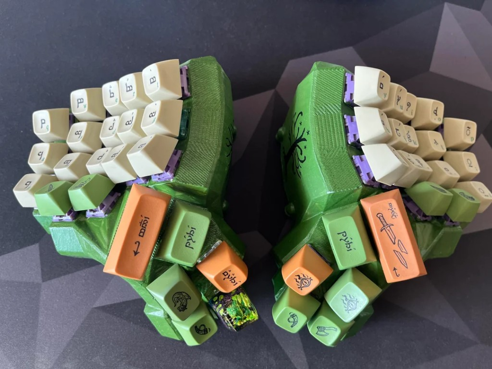
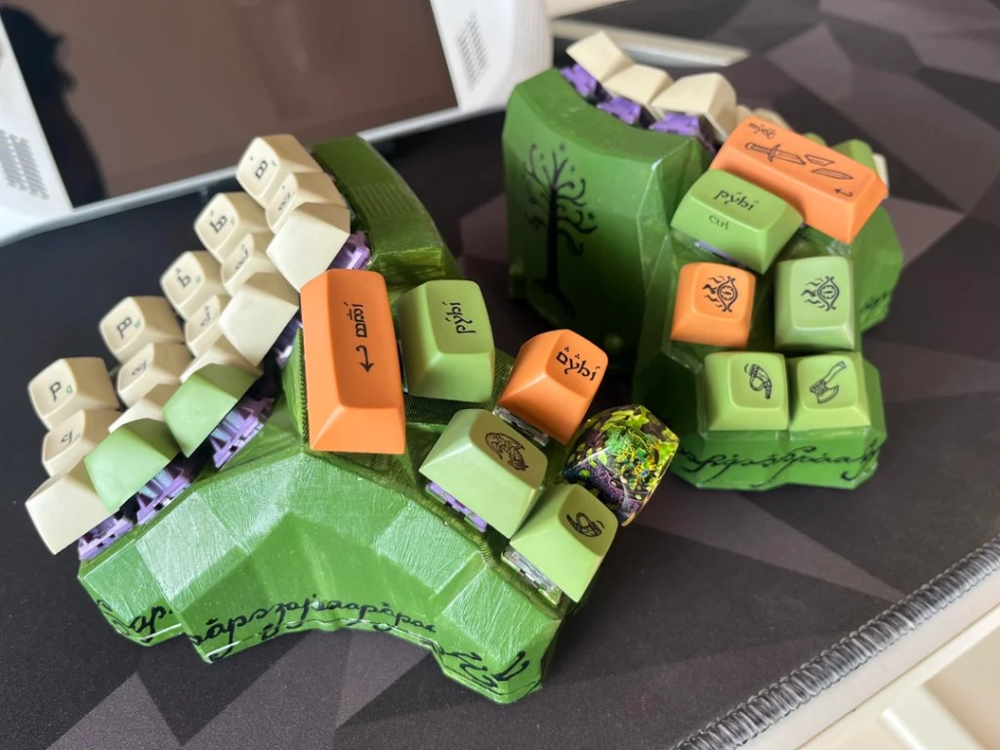
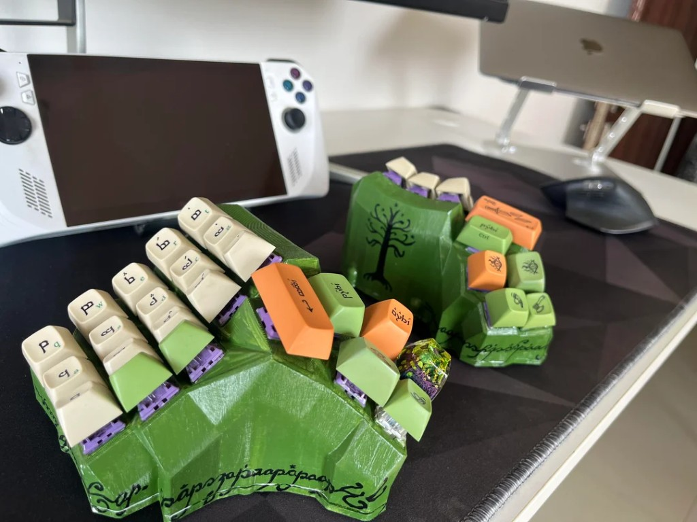
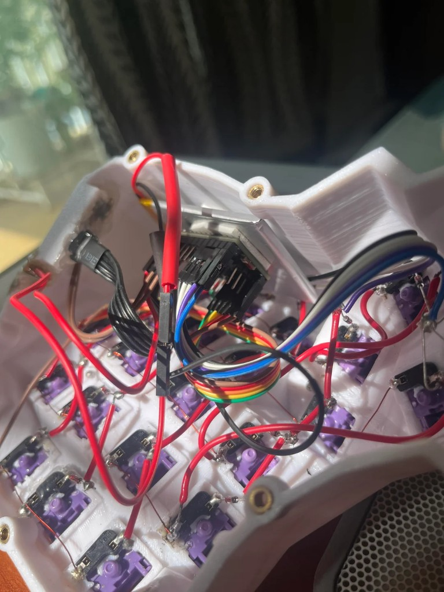

# Dactyl Manuform 4x5 — LOTR Themed ZMK Keyboard

A hand-wired, split ergonomic keyboard built on the Dactyl Manuform 4x5 layout, running [ZMK firmware](https://zmk.dev/) on nice!nano controllers. The case is 3D-printed and painted with a Lord of the Rings theme, featuring Elvish script, the White Tree of Gondor, and LOTR keycaps from Drop. The firmware uses **[home row mods](https://zmk.dev/docs/behaviors/mod-tap)** (mod-tap): Shift, Ctrl, Alt, and Gui live on the home row so you hold for the modifier and tap for the letter.



## The Build





### Internal Wiring

Hand-wired matrix with diodes (col2row), connected to nice!nano controllers via a Pro Micro-compatible pinout.



## Specs

|                     |                                                     |
| ------------------- | --------------------------------------------------- |
| **Layout**          | Dactyl Manuform 4x5, split                          |
| **Keys**            | 46                                                  |
| **Home row mods**   | Mod-tap: Shift/Ctrl/Alt/Gui on `A`–`F` and `J`–`;`  |
| **Matrix**          | 10 columns x 5 rows                                 |
| **Controller**      | nice!nano v2 (nRF52840)                             |
| **Firmware**        | ZMK                                                 |
| **Connectivity**    | Bluetooth (split halves communicate over BLE) + USB |
| **Diode direction** | col2row                                             |
| **Case**            | 3D-printed, hand-painted                            |

## Keymap

Four layers. The default layer uses **home row mods** via ZMK’s `&mt` (mod-tap) behavior: the home row still types letters when tapped, but acts as modifiers when held.

### Layer 0 — Default (QWERTY)

```
 ┌─────┬─────┬─────┬─────┬─────┐               ┌─────┬─────┬─────┬─────┬─────┐
 │  Q  │  W  │  E  │  R  │  T  │               │  Y  │  U  │  I  │  O  │  P  │
 ├─────┼─────┼─────┼─────┼─────┤               ├─────┼─────┼─────┼─────┼─────┤
 │SH/A │CT/S │AL/D │GU/F │  G  │               │  H  │GU/J │AL/K │CT/L │SH/; │
 ├─────┼─────┼─────┼─────┼─────┤               ├─────┼─────┼─────┼─────┼─────┤
 │  Z  │  X  │  C  │  V  │  B  │               │  N  │  M  │  ,  │  .  │  /  │
 └─────┴─────┼─────┼─────┼─────┘               └─────┼─────┼─────┼─────┴─────┘
             │  [  │  ]  │                             │  -  │  =  │
             └─────┴─────┘                             └─────┴─────┘
                   ┌─────┬─────┐           ┌─────┬─────┐
                   │SPACE│ TAB │           │BSPC │SPACE│
                   ├─────┼─────┤           ├─────┼─────┤
                   │RAISE│LOWER│           │LOWER│RAISE│
                   ├─────┼─────┤           ├─────┼─────┤
                   │ADJST│ ESC │           │ENTER│ADJST│
                   └─────┴─────┘           └─────┴─────┘
```

Home-row mods use balanced flavor (280ms tapping term, 75ms quick-tap).

### Layer 1 — Lower (Navigation & Media)

Arrow keys, Home/End, Page Up/Down, volume, and media controls.

### Layer 2 — Raise (Numbers & Symbols)

`! @ # $ % ^ & * ( )` on the top row, `1–0` on the home row, plus `'` and `\`.

### Layer 3 — Adjust (System)

Bluetooth profile selection (0–4), BT clear, USB/BLE output toggle, mouse movement and clicks, and the Globe key.

## Firmware

Built with the [ZMK user config](https://zmk.dev/docs/user-setup) pattern. GitHub Actions compiles the firmware automatically on every push.

### Building

Push to the `main` branch (or open a PR) and GitHub Actions will produce a `firmware` artifact containing `.uf2` files for both halves:

- `dactyl_manuform_left-nice_nano.uf2`
- `dactyl_manuform_right-nice_nano.uf2`
- `settings_reset-nice_nano.uf2`

### Flashing

1. Put the nice!nano into bootloader mode (double-tap reset).
2. Copy the appropriate `.uf2` file to the mounted drive.
3. Flash the left half first (it's the central/host side).

## Project Structure

```
├── .github/workflows/build.yml    # CI workflow
├── boards/shields/dactyl_manuform
│   ├── dactyl_manuform.dtsi        # Matrix & key transform
│   ├── dactyl_manuform.keymap      # Keymap & layers
│   ├── dactyl_manuform.zmk.yml     # Shield metadata
│   ├── dactyl_manuform_left.overlay
│   ├── dactyl_manuform_right.overlay
│   ├── Kconfig.defconfig
│   └── Kconfig.shield
├── config
│   ├── dactyl_manuform.conf        # Firmware config options
│   └── west.yml                    # ZMK manifest
├── zephyr/module.yml
├── build.yaml                      # Build matrix
└── images/                         # Build photos
```

## Credits

- Case design based on the [Dactyl Manuform](https://github.com/abstracthat/dactyl-manuform)
- Firmware powered by [ZMK](https://zmk.dev/)
- Controller: [nice!nano](https://nicekeyboards.com/nice-nano/)
